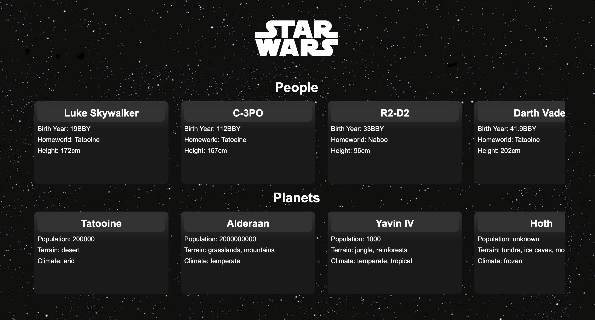

# Swapi

An application used to list Star Wars characters and planets. Built with React, JavaScript, and CSS.  
Check it out [here](https://swapidb.netlify.app/)!

## Project Status

- Complete with room for improvements.

- Currently results take a while to load due to multiple calls made.

- Right scroll to view more people/planets.

## Reflection

1. What was the context for this project?\
   This project was made to freshen up on API calls and data manipulation.
2. Tools used:

- React
- Axios
- [SWAPI API](https://swapi.dev/)
- JS
- CSS

3. Challenges?\
   Ones challenge was making a call from within the results. At times the data needed was only reacheable through another call, from from the results; so looping through that the results and making a call to another endpoint, which results in the render taking a while to load.
